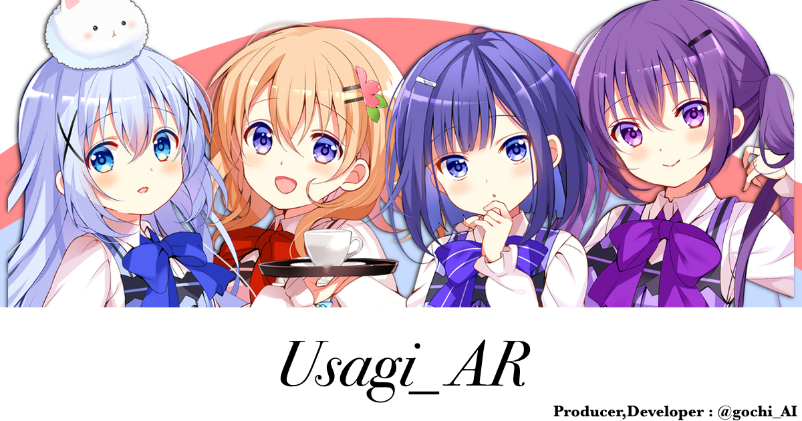

<h1>INFO</h1>
v.2.0~ global release soon..

<h2>What't 2.0??</h2>
The site was built from scratch by me (forgive me if it's a bit hard to use).
Up to three images can be added. 
Will work offline.

<h2>LINK</h2>
<a href='https://yumemi.web.app/usagi_AR/'>[stable]</a> 
<a href='https://gochiai.github.io/usagi_AR/'>[dev]</a>

 
<h1>~v.2</h1>

This project is an unauthorized reuse of an official service.  
There is a possibility that this project may be closed.  

<h2>Customization</h2>

- Remove access to the stamp rally  
- AR using different images  
- I18N

<h2>How does it work?</h2>
This project is operated by copying and partially editing the service that was adopted by the official without permission.  
To be frank, it is not good.  
I have to pay a certain amount of money originally.  
So in the future, we would like to change it to scratch (completely written by ourselves from scratch) and clean it up, but well, it's impossible, this service is completely above us.   It's incredibly useful and educational.  
<h2>So why not?</h2>
It's for people who can't see AR content.  
This originally required people to go to the site and read the QR code at the event.  
It was also only available for a limited time and it was unknown at the time when it would be gone.
We want to touch as many people as possible, so we are making it multilingual.  
Please let me know if there are any languages you need.  
It will be machine translated, but it's better than nothing (maybe).  

 
<h1>CHANGE LOG</h1>
<h2 name="~v.2.9">~v.2.9</h2>
<a href='https://github.com/gochiAI/usagi_AR/discussions/5'>CHECK</a>
<h2 name="v2.9_3">v.2.9^3</h2>

- Display of ver names
- Installation of a button to clear the cache
- Correction of some UI
- Correction of some device bugs

<h2 name='v.3.1.8a'>v.3.1.8a</h2>

First version of v3 series
The following two features will be added and tested on actual equipment.

- Clean button on the list  
Empties the previously selected character list.

- Save image position  
Saves and restores the moved position.
Minimum Functions

<h2>Next ver schedule</h2>
Adjustment:'Save image position'
first step: 'Toggle display'

